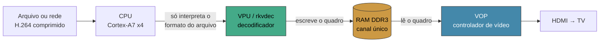

---
tags:
  - hardware
  - rockchip
  - rk322x
  - linux
  - video
aliases:
  - RK3229
  - Arquitetura RK322x
criado: 2026-08-10
status: validado em hardware
---

# Arquitetura do TV Box RK322x

> [!success] Resultado final
> **Full HD a 60 quadros por segundo, com zero perdas**, numa TV box de ~R$ 50 de 2016 — kernel Linux mainline, drivers abertos, sem nenhum blob proprietário.
>
> E o mais interessante: o que travava não era o hardware. Eram **duas linhas de configuração**.

---

## 1. O que é essa caixinha

| Peça | Especificação |
|---|---|
| **SoC** | Rockchip RK3229 (família RK322x), 2016 |
| **CPU** | 4 núcleos ARM Cortex-A7, 32 bits, 1,2 GHz (1,488 GHz com overclock) |
| **GPU** | Mali-400 MP2 — só OpenGL ES 2.0, sem Vulkan, sem OpenCL |
| **RAM** | 2 GB DDR3, canal único |
| **Armazenamento** | eMMC 8 GB |
| **Rede** | Ethernet 100 Mbit |
| **Saída** | HDMI |

---

## 2. Os chips que fazem o trabalho

O processador **não** decodifica vídeo. Quem faz isso são blocos dedicados dentro do mesmo chip:



| Bloco | Papel | Capacidade medida |
|---|---|---|
| **CPU** Cortex-A7 | Desmonta o arquivo, acha onde cada quadro começa | Trabalho leve |
| **VPU** (`rkvdec`) | Decodifica H.264 por hardware | **231 quadros/s em Full HD** |
| **VOP** | Lê o quadro pronto e empurra pelo HDMI | 60 ciclos/s (confirmado) |
| **GPU** Mali-400 | Interface gráfica — **irrelevante para vídeo** | driver Lima, frágil |

> [!tip] O melhor caminho de vídeo não passa pela GPU
> Vai direto do decodificador para o controlador de display. Sem X11, sem Wayland, sem OpenGL. É mais rápido **e** mais estável.

---

## 3. Zero-copy: o conceito que separa 10 fps de 231 fps

Todos os blocos compartilham a mesma memória. E existem dois jeitos de levar o quadro do decodificador até a tela.

### ❌ Com cópia

O quadro é copiado da área do VPU para a memória normal, a CPU mexe nele, e só então vai pra tela.

O problema: a memória onde o VPU escreve **não passa pelo cache do processador**. Ler isso com um Cortex-A7 é brutalmente lento.

| Etapa (Full HD) | Resultado |
|---|---|
| Decodificar, quadro fica na área do VPU | **102 fps** (225 com a memória acelerada) |
| + copiar de volta pra memória normal | **10 fps** |
| + converter formato de cor | 8 fps |

**A cópia sozinha come 90% do desempenho.**

### ✅ Sem cópia (*zero-copy*)

O quadro **nunca sai do lugar**. O decodificador entrega um "passe de acesso" (**DMA-BUF**) e o controlador de display lê direto dali. A CPU nunca toca na imagem.

Como confirmar — os parâmetros negociados têm que dizer:

```
video/x-raw(memory:DMABuf), format=DMA_DRM, drm-format=NV12
```

> [!warning] Um `videoconvert` no meio quebra o zero-copy
> Qualquer elemento que precise "olhar" a imagem força a cópia e derruba tudo.

---

## 4. O mistério dos 30 fps — e a resposta

Durante boa parte da investigação, Full HD travava em **exatamente 30,00 fps**. Nunca 28, nunca 33. Sempre a metade cravada de 60.

### A pista que quase passou batido

Esse número redondo era o fato mais importante. **Saturação de recurso produz números quebrados e instáveis** — 38 fps, 44, oscilando. Travar na metade exata é assinatura de **serialização**: alguma coisa esperando duas vezes o que deveria esperar uma.

Quatro suspeitos foram medidos e todos inocentados:

| Suspeito | Como foi testado | Veredito |
|---|---|---|
| Banda de memória | Testado a 534, 660 e 786 MHz | **Inocente** — 60 fps em todas |
| Hardware de vídeo (VOP) | Contador de interrupções | **Inocente** — 60 ciclos/s sempre |
| Driver do kernel | `ftrace` no caminho de commit | **Inocente** — 0,14 ms (1% do orçamento) |
| Decodificador | Medido sem display | **Inocente** — 231 fps |

### A causa: vsync duplo

O `kmssink` (quem entrega o quadro pra tela) **esperava o vsync internamente**. E o driver do Rockchip, que é um driver atômico moderno, **espera de novo** no momento de trocar o quadro.

Duas esperas encadeadas por quadro. A TV oferece 60 janelas por segundo, e o software só conseguia usar uma sim, uma não.

A documentação da própria propriedade descreve o problema com todas as letras:

> `skip-vsync` — *"When enabled will not wait internally for vsync. **Should be used for atomic drivers to avoid double vsync**."*

### O cúmplice: QoS

Corrigir o vsync duplo levou de 30 para **50 fps** — melhor, mas ainda não era 60.

O que faltava: o **QoS** do GStreamer descarta quadros preventivamente quando os julga atrasados. Só que o atraso que ele media era causado justamente pelo vsync duplo. Os dois problemas se realimentavam.

Desligando os dois: **60,02 fps, zero perdas**.

---

## 5. A configuração que funciona

```bash
gst-launch-1.0 filesrc location=video.mp4 ! qtdemux ! h264parse \
  ! v4l2slh264dec \
  ! kmssink driver-name=rockchip skip-vsync=true qos=false sync=true
```

Duas propriedades. É literalmente isso.

### Resultados medidos

| Modo | Resultado |
|---|---|
| **1080p60** | **59,96 / 60,02 fps · 0 perdas** (reproduzido) |
| 1080p30 | 30,06 fps · 0 perdas |
| 1080p25 | 25,04 fps · 0 perdas |
| 720p60 | 59,96 fps · 0 perdas |

Temperatura em carga: **64–67 °C**.

### `/boot/armbianEnv.txt`

```
extraargs=coherent_pool=2M cma=128M video=HDMI-A-1:1920x1080@60
user_overlays=cpuoc dmcon ddr786
```

> [!danger] `force-modesetting=true` quebra o 1080p
> Falha com `Unsupported pixel format` / `not-negotiated (-4)` e a tela fica preta. Use **só** quando o controlador precisa trocar de resolução (caso do 720p). Em Full HD, fixe o modo pelo `armbianEnv.txt` e deixe desligado.

---

## 6. Por que o Android parecia melhor

A resposta honesta, depois de tudo medido: **não era o Android que era melhor — era o nosso software que estava configurado errado.**

O silício sempre deu conta. O decodificador faz quase quatro vezes o necessário, o controlador de vídeo tem 60 janelas por segundo, e a memória sobra até na frequência mais baixa.

O que o Android tem de verdade é um driver escrito pela própria Rockchip, que conhece os caminhos certos por construção. O Linux mainline foi escrito por voluntários, por engenharia reversa, sem documentação — e o caminho certo existe, só não vem ligado por padrão.

### Um extra que o Android tem: memória com escalonamento

A RAM não roda sempre na mesma velocidade. Existem dois blocos no chip:

- **DFI** (`dfi@11210000`) — mede o tráfego de memória
- **DMC** (`dmc@11200000`) — troca a frequência da RAM em tempo real

O Android usa os dois: quando o tráfego aperta, a memória acelera; quando o vídeo acaba, ela desacelera pra economizar energia.

**Isso também existe no mainline** — o driver `rk3228_dmc` já vem compilado no Armbian. O nó só estava **desligado** no device tree. Dois overlays resolvem:

```dts
/* liga o controlador de memória */
&{/dmc@11200000} { status = "okay"; };

/* libera a frequência mais alta (786 MHz, pede 1,15 V) */
&{/dmc-opp-table/opp-786000000} { status = "okay"; };
```

Com isso a memória escala sozinha entre 330 e 786 MHz, e o driver reporta:

```
rk3228-dmc: Rockchip SIP initialized, version 2
rk3228-dmc: detected DDR3 memory
rk3228-dmc: TEE DRAM configuration initialized
```

> [!note] Mas o overclock não era necessário
> Depois de descobrir a causa real, testei Full HD 60 fps a **534, 660 e 786 MHz** — zero perdas em todas. A memória nunca foi o gargalo. O overclock é estável e dá folga, mas **não é ele que entrega os 60 fps**. Mantido por ser gratuito e reversível (basta remover `dmcon ddr786` do `user_overlays`).

---

## 7. Armadilhas de medição que custaram a investigação inteira

> [!danger] Leia antes de repetir esse trabalho — foram elas que criaram o mito de "mainline = 720p"

**`fakesink` mede a coisa errada.** Ele força a cópia da imagem pra memória normal — justamente o caminho lento. Todo benchmark feito assim mede a cópia, não o decodificador. Use `fakevideosink` para throughput puro, ou `kmssink` para o caminho real.

**`strace` e `ftrace` nivelam o que você quer comparar.** O overhead é tão grande que os dois casos comparados convergem para a mesma taxa. Sob `strace`, Full HD e HD deram contagens de chamada *idênticas*. **Só as durações por chamada valem — nunca as taxas.**

**Um número redondo demais é uma pista, não um resultado.** "Exatamente 30,00 fps" gritava serialização desde o primeiro dia. Tratar isso como saturação levou a calcular larguras de banda que não explicavam nada.

**A numeração de `/dev/videoN` muda a cada boot.** Num boot `video0` é o decodificador, no outro é o redimensionador. Regra udev para nomes estáveis:

```
SUBSYSTEM=="video4linux", ATTR{name}=="rkvdec", SYMLINK+="video-rkvdec"
SUBSYSTEM=="video4linux", ATTR{name}=="rockchip-rga", SYMLINK+="video-rga"
```

**A resolução da tela tem que bater com a do vídeo.** Descasado, o redimensionamento derruba tudo: 720p60 numa tela de 1080p dá 18–30 fps; casado dá 60.

**`qos` é propriedade do `kmssink`**, não do `fpsdisplaysink`.

**`-v` do `gst-launch` tem que vir antes do pipeline**, senão não sai estatística nenhuma.

**Aumentar CMA não resolve nada.** Testado de 16 para 128 MB, zero diferença. O mantenedor do Armbian para essa plataforma explica: *"rockchip has no need for large CMA buffers since hardware decoders have their own MMUs"*.

**`echo senha | sudo -S comando | tee arquivo` cria arquivo vazio.** O `sudo` consome a entrada inteira. Use `sudo sh -c 'cat > arquivo <<EOF'`.

---

## 8. Verificações rápidas

```bash
# frequência da memória agora
cat /sys/class/devfreq/11200000.dmc/cur_freq

# o decodificador (nome estável)
ls -l /dev/video-rkvdec

# o controlador de vídeo está ticando a 60 Hz?
grep vop /proc/interrupts    # medir duas vezes com 1s de intervalo

# throughput puro do decodificador, sem display e sem cópia
gst-launch-1.0 -v filesrc location=X.mp4 ! qtdemux ! h264parse ! v4l2slh264dec \
  ! fpsdisplaysink video-sink=fakevideosink text-overlay=false sync=false
```

---

## 9. O que era ponta solta e virou sistema

Tudo nas seções acima foi medido tocando **arquivo local**. O que faltava era transformar isso em
algo usável no dia a dia — e isso está pronto:

- **Receptor de rede** — cinco serviços systemd sobem no boot: `tv-player` (controle por JSON/TCP na 5010), `tv-web` (página do celular na 8080), `tv-receiver` (vídeo RTP H.264 na 5004), `tv-receiver-audio` (áudio RTP L16 na 5006) e `tv-remote` (controle infravermelho). Espelhando 1080p60: 60,0 fps, zero perdas, ~56 ms de vídeo e ~60 ms de áudio.
- **Áudio HDMI** — funciona. O `HDMI: Unknown ELD version 0` do log é ruído: a TV não devolve um ELD que o driver reconheça, o que não impede a saída. Espelhando, dá pra mandar **só o som da janela capturada** em vez da mistura do sistema inteiro (o porquê e como está no README).
- **IP fixo** — `192.168.10.159` fixado no NetworkManager da própria box, não mais por sorte do DHCP.
- **Publicar a correção** — o repositório `rk322x-mediaplayer` já está reescrito em cima do resultado certo.

---

## 10. O que continua em aberto

- **Post no fórum Armbian** (tópico 34923) — redigido, ainda não publicado. É onde a correção do "720p" alcançaria quem procura pelo assunto.
- **Controle infravermelho — FEITO.** O serviço `tv-remote` lê o receptor da box e comanda o player. O keymap embutido do kernel (`rc-rk322x-tvbox`) **não serve** para todo controle: ele espera endereço NEC `0x4040` e o desta unidade usa `0x01` — os códigos chegam e nenhuma tecla é gerada, sem erro nenhum. Capture o seu com o modo aprendizado do `tv-remote-test` (`:8081`). Ver o README para as duas armadilhas que quebram o sistema: nunca mapear `0x1ff` (é lixo de decodificação dos botões de TV) e `HandlePowerKey=ignore` (sem ele, POWER desliga a box).
- **CEC — descartado nesta TV, medido.** Com o "T-Link" (nome do HDMI-CEC na TCL) **ligado**, a TV responde consultas em 26–39 ms mas ignora `Standby`, `Image View On` e `Active Source`, e nunca encaminha tecla do próprio controle. Aceita tudo sem `Feature Abort` e não obedece. Não é configuração: é a implementação dela. O IR resolve o que o CEC não resolveu.
- **Buscar dentro do vídeo em 1080p** — o formato que o YouTube entrega nessa qualidade é MP4 fragmentado e o `qtdemux` não busca nele. Pausa, fila e próximo/anterior funcionam.
- **`yt-dlp` é manutenção perpétua** — o YouTube quebra versões antigas com frequência, e os cookies da conta descartável expiram. Os dois sintomas se parecem: só formatos de storyboard aparecem.
- **Dissipador** — 80 °C numa live longa de 1080p60, sem nada colado no chip. O throttling começa perto dos 90 °C.

---

## Ver também

- [[Receptor de vídeo na TV via rede]]
- [[Loop de terra HDMI e a morte da GPU]]
- [[Projeto rk322x-mediaplayer]]
